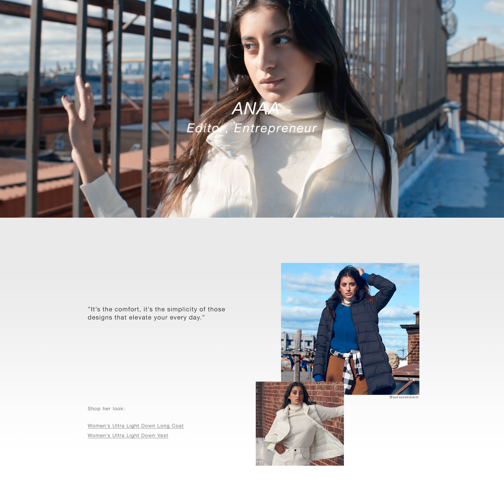

# Description
Describes the project. This is a project featuring a quick brown fox jumping over a lazy dog.

# Project Deets

**Project Owner**: Yabe  
**Developer**: Tiffany  
**Date Launch**: 02/20/20  
**Season**: 20SS  
**Type**: Feature Page  

# Notes on the Readme Elements Above
### *You can delete this section in your actual readme*

### Image of Main
The image you include up top is typically a portion of the layout defined by the design team. This is included simply to give a quick hint as to what this project is.

### Examples of Types

- Feature Page  
- Banner
    - L3
    - PDP
- Custom Feature  
- Template  
- Content Header

### Formatting Lists
Custom lists — like project deets above — need to include two spaces at the ends of lines to force line breaks.
